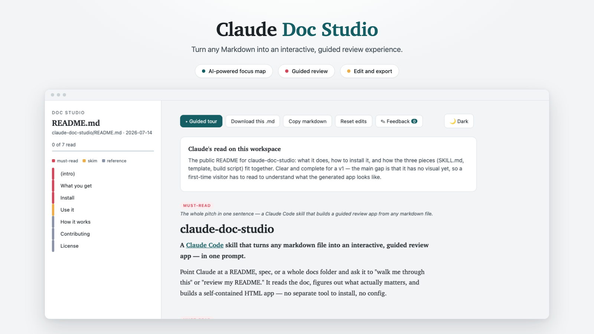

<p align="center">
  
</p>

Point Claude at a README, spec, or a whole docs folder and ask it to "walk me through this" or "review my README." It reads the doc, figures out what actually matters, and builds a self-contained HTML app — no separate tool to install, no config.

## What you get

- **Focus map** — every section tagged `must` / `skim` / `ref`, color-coded, so you know what to actually read
- **Guided tour** — a spotlight walkthrough ordered by importance, with keyboard navigation
- **Inline suggestions** — Claude's proposed fixes pinned to the exact section, accept or dismiss in one click
- **Click-to-edit** — rewrite any section in place, right in the app
- **Export back to `.md`** — download the edited doc, or hand it back to Claude to apply to the source file
- **Ask-Claude panel** — ask follow-up questions about a specific section, live
- **Multi-file workspace mode** — point it at a repo or folder and get one app with a file switcher, a suggested reading order, and cross-file findings (duplicated content, contradictions, broken links)
- **Light/dark toggle** — remembers your choice, overrides system preference either direction

Everything happens locally when you're in Claude Code: it builds the HTML file next to your docs and serves it from a small local server with a live feedback loop back to Claude.

## Install

```bash
git clone https://github.com/saimohan16/claude-doc-studio.git ~/.claude/skills/md-experience
```

That's it — Claude Code picks up skills from `~/.claude/skills/` automatically. No dependencies beyond Python 3 (standard library only) and a browser.

## Use it

In Claude Code, just ask naturally:

- "Walk me through this doc" / "make this readable" / "what should I focus on"
- "Review my README"
- Point it at a folder or repo: "give me an overview of these docs"

Claude reads the markdown, analyzes it, builds the app, and opens it in your browser. Leave suggestions, edit sections, or use the feedback drawer to send notes straight back to Claude for a live back-and-forth review loop.

## How it works

The skill is three pieces, kept deliberately separate so nothing gets hand-rolled per document:

| Piece | Role |
|---|---|
| `SKILL.md` | Tells Claude how to analyze a doc and assign priority/suggestions — the only part read on every invocation |
| `assets/viewer_template.html` | The actual app — a static, self-contained HTML/CSS/JS file, never regenerated per document |
| `scripts/build_viewer.py` | Validates Claude's analysis JSON and injects it into the template to produce `<name>.studio.html` |
| `scripts/studio_serve.py` | A stdlib-only local server for the live review loop (feedback POST, auto-reload on rebuild) |

Works inside Claude.ai too (as an artifact, or streamed inline if a widget tool is available) — the delivery path is chosen automatically based on environment.

## Contributing

Issues and PRs welcome — especially around new judgment calls for the analysis step, or template/UX improvements to the generated app.

## License

[MIT](LICENSE)
